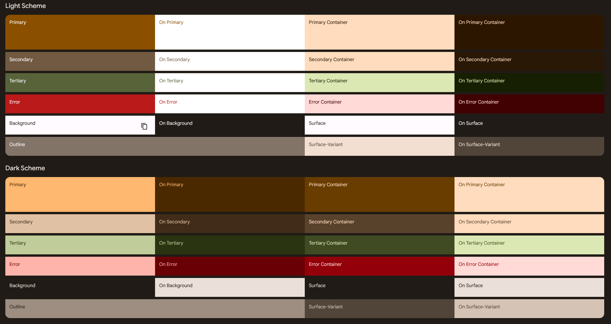

# dookie_controls

Control Component for the [ShitBox3000](https://github.com/ArneH666/shitbox-3000)

## Ideas
- Different App Designs based on Car Brand
- Car Brand Gimmicks
    - __Volkswagen__: Ad breaks when changing pages and Ad Banners on Dookie Clicker
    - __BMW__: Check Engine Light always on and cant use the Turn Signals
    - __Mercedes__: Wont log in but gives a push notification telling to buy it, then forwards to a YouTube video or something
    - __Random Chinese Brand__: Shitbox but in Chinese `狗屎盒 - Gǒu shǐ hé`, receives 1 sec Input Lag, most buttons dont work, Chinese Background Music

- Dookie Clicker, a knock-off cookie clicker  
- Gacha Game
- Skin Shop
- Internet Radio ([As seen here](https://pub.dev/packages/flutter_radio_player/example))

## Colors
Color Scheme used in the App

